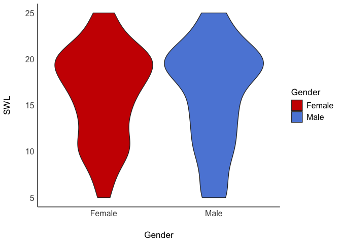

Lab3
================
Mursal
2024-09-19

# Load Packages

``` r
library(haven)
library(dplyr)
```

    ## 
    ## Attaching package: 'dplyr'

    ## The following objects are masked from 'package:stats':
    ## 
    ##     filter, lag

    ## The following objects are masked from 'package:base':
    ## 
    ##     intersect, setdiff, setequal, union

``` r
library(tidyr)
library(ggplot2)
library(psych)
```

    ## Warning: package 'psych' was built under R version 4.3.3

    ## 
    ## Attaching package: 'psych'

    ## The following objects are masked from 'package:ggplot2':
    ## 
    ##     %+%, alpha

``` r
library(bruceR)
```

    ## Warning: package 'bruceR' was built under R version 4.3.3

    ## 
    ## bruceR (v2024.6)
    ## Broadly Useful Convenient and Efficient R functions
    ## 
    ## Packages also loaded:
    ## ✔ data.table ✔ emmeans
    ## ✔ dplyr      ✔ lmerTest
    ## ✔ tidyr      ✔ effectsize
    ## ✔ stringr    ✔ performance
    ## ✔ ggplot2    ✔ interactions
    ## 
    ## Main functions of `bruceR`:
    ## cc()             Describe()  TTEST()
    ## add()            Freq()      MANOVA()
    ## .mean()          Corr()      EMMEANS()
    ## set.wd()         Alpha()     PROCESS()
    ## import()         EFA()       model_summary()
    ## print_table()    CFA()       lavaan_summary()
    ## 
    ## For full functionality, please install all dependencies:
    ## install.packages("bruceR", dep=TRUE)
    ## 
    ## Online documentation:
    ## https://psychbruce.github.io/bruceR
    ## 
    ## To use this package in publications, please cite:
    ## Bao, H.-W.-S. (2024). bruceR: Broadly useful convenient and efficient R functions (Version 2024.6) [Computer software]. https://CRAN.R-project.org/package=bruceR

    ## 
    ## These packages are dependencies of `bruceR` but not installed:
    ## - pacman, openxlsx, ggtext, lmtest, vars, phia, MuMIn, GGally
    ## 
    ## ***** Install all dependencies *****
    ## install.packages("bruceR", dep=TRUE)

``` r
library(ggsci)
```

    ## Warning: package 'ggsci' was built under R version 4.3.3

``` r
library(see)
```

    ## Warning: package 'see' was built under R version 4.3.3

    ## 
    ## Attaching package: 'see'

    ## The following objects are masked from 'package:ggsci':
    ## 
    ##     scale_color_material, scale_colour_material, scale_fill_material

# Load Datasets

``` r
lab3data <- read.csv("/Users/mursal_j/Documents/GitHub/Lab3/lab3data.csv")
```

# Missing Data

``` r
#Listwise deletion
list_lab3data<- drop_na(lab3data)

#pair wise deletion will only be used when you run the actual analysis using "na.rm = TRUE"
```

# Recode Variables: Changing Numeric Values to Characters

``` r
lab3data %>% count(Gender)
```

    ##   Gender   n
    ## 1      1 154
    ## 2      2 145
    ## 3     NA   1

``` r
#Solution 1
lab3data<- lab3data%>%
  mutate_at(c('Gender'),funs(str_replace(., "1", "Male")))
```

    ## Warning: `funs()` was deprecated in dplyr 0.8.0.
    ## ℹ Please use a list of either functions or lambdas:
    ## 
    ## # Simple named list: list(mean = mean, median = median)
    ## 
    ## # Auto named with `tibble::lst()`: tibble::lst(mean, median)
    ## 
    ## # Using lambdas list(~ mean(., trim = .2), ~ median(., na.rm = TRUE))
    ## Call `lifecycle::last_lifecycle_warnings()` to see where this warning was
    ## generated.

``` r
#Solution 2

#lab3data$Gender<-recode(lab3data$Gender, '1' = 'X', '2' = 'Y')


#Now recode 2 into Female
lab3data<- lab3data%>%
  mutate_at(c('Gender'),funs(str_replace(., "2", "Female")))
```

    ## Warning: `funs()` was deprecated in dplyr 0.8.0.
    ## ℹ Please use a list of either functions or lambdas:
    ## 
    ## # Simple named list: list(mean = mean, median = median)
    ## 
    ## # Auto named with `tibble::lst()`: tibble::lst(mean, median)
    ## 
    ## # Using lambdas list(~ mean(., trim = .2), ~ median(., na.rm = TRUE))
    ## Call `lifecycle::last_lifecycle_warnings()` to see where this warning was
    ## generated.

# Recode Variables: Changing Numeric Values to Different Numeric Values

``` r
lab3data %>% count(RSE2)
```

    ##   RSE2   n
    ## 1    1 124
    ## 2    2  86
    ## 3    3  53
    ## 4    4  37

``` r
lab3data$RSE2_R <- 5 - lab3data$RSE2
#four is highest possible value on the scale therefore we put 5
#check to see if the recoding was successful
lab3data %>% count(RSE2_R)
```

    ##   RSE2_R   n
    ## 1      1  37
    ## 2      2  53
    ## 3      3  86
    ## 4      4 124

``` r
#line of code above is useful to know if it worked (you need to see that the order switched)
#Now do the same for the other items (5,6,8,9)
lab3data$RSE5_R <- 5 - lab3data$RSE5
lab3data$RSE6_R <- 5 - lab3data$RSE6
lab3data$RSE8_R <- 5 - lab3data$RSE8
lab3data$RSE9_R <- 5 - lab3data$RSE9
#to count & check
lab3data %>% count(RSE5_R)
```

    ##   RSE5_R   n
    ## 1      1  26
    ## 2      2  49
    ## 3      3 108
    ## 4      4 117

``` r
lab3data %>% count(RSE5)
```

    ##   RSE5   n
    ## 1    1 117
    ## 2    2 108
    ## 3    3  49
    ## 4    4  26

# Create Composites

``` r
#Depending on the scale, sometimes you need to average across the items, other times you might need to sum 

#Notes from class: Need to look up codebook for open source data sets to learn which items are reverse coded! We need to recode all items in same direction to be taken into consideration when making a composite score.

#Fill in the items
lab3data <- lab3data %>%
  mutate(RSE = rowMeans(cbind(RSE1, RSE2_R, RSE3, RSE4, RSE5_R, RSE6_R, RSE7, RSE8_R, RSE9_R, RSE10)))

#Create another composite for SWL, but this time use rowSums
#Note from class: there was no reverse items so we can skip that step!
lab3data <- lab3data %>%
  mutate(SWL = rowSums(cbind(SWL1, SWL2, SWL3, SWL4, SWL5)))
```

# Get Summary Descriptive Statistics

``` r
lab3data %>% 
  group_by(Gender) %>%
  #I am assigning the name mean_RSE to the value of the formula mean(RSE).
  dplyr::summarize(mean_RSE    = mean(RSE),
      mean_SWL    = mean(SWL),
      std_dev_RSE = sd(RSE),
      std_dev_SWL = sd(SWL),
      corr_RSE_SWL  = cor(RSE, SWL))
```

    ## # A tibble: 3 × 6
    ##   Gender mean_RSE mean_SWL std_dev_RSE std_dev_SWL corr_RSE_SWL
    ##   <chr>     <dbl>    <dbl>       <dbl>       <dbl>        <dbl>
    ## 1 Female     2.98     16.3       0.641        4.97        0.356
    ## 2 Male       3.12     16.2       0.683        5.48        0.496
    ## 3 <NA>       2.6      16        NA           NA          NA

# Q1: Descrptively, which group has a higher self-esteem? What about life satisfaction? Is the relationship between self-esteem and life satisfaction stronger for males or for females?

\#The male group has a higher self-esteef, and the female group has
higher satisfaction with life- althought it is a very small difference.
The relationship between the two scores are more strongly correlated in
males with a value of 0.49.

# Visualization of Data Distribution

``` r
lab3data<- lab3data %>%
  drop_na(Gender)


ggplot(lab3data, aes(x = Gender, y = RSE)) + geom_violin(aes(fill=Gender)) + scale_fill_simpsons() + theme_modern()
```

<!-- -->

``` r
#Create a plot for SWL by Gender with a different color palette
lab3data<- lab3data %>%
  drop_na(Gender)

#to find more scales:
?scale_fill_simpsons

ggplot(lab3data, aes(x = Gender, y = SWL)) + geom_violin(aes(fill=Gender)) + scale_fill_startrek() + theme_modern()
```

<!-- -->

# Q2: What you can tell from looking at a violin plot? What you cannot tell? What inferences you can make based on the two violin plots?

\#From this plot, I can tell the range of responses and the distribution
of responses, an estimate of the mean and the mode and I can compare the
two groups in terms of these points. I cannot tell an exact value for
the descriptive statistics or what individual scores might have looked
like. From the plot, I can infer that most females score in the RSE
scale are in the midrange whereas men tend to score higher as seen with
the larger distribution of male scores at the hgihest point of the plot.
In terms of SWL, despite the two groups having similar means on the
table, there seems to be a greater number of females closer to the mean
value than males. There is also two peaks as opposed to the single peak
in males.
